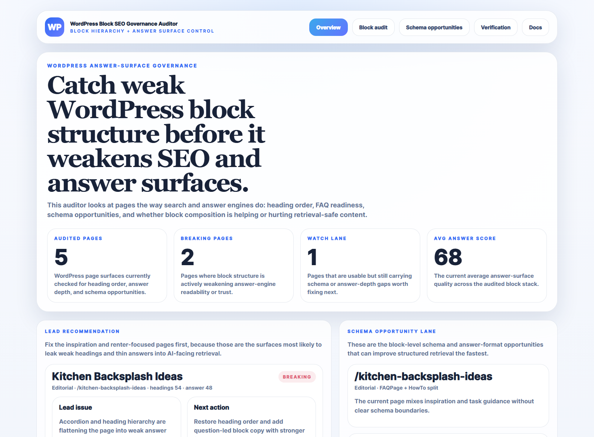
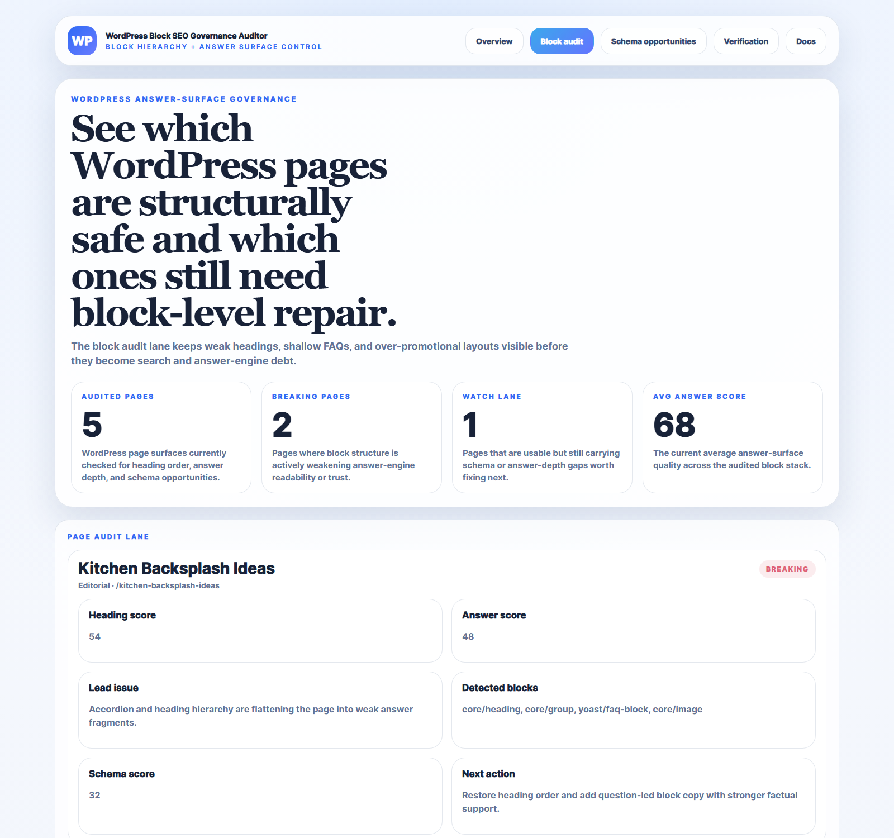
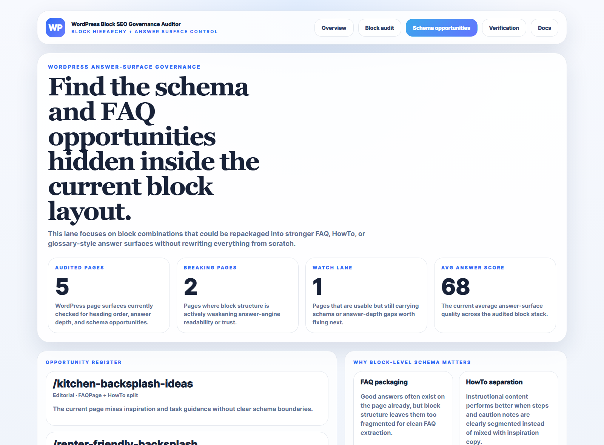
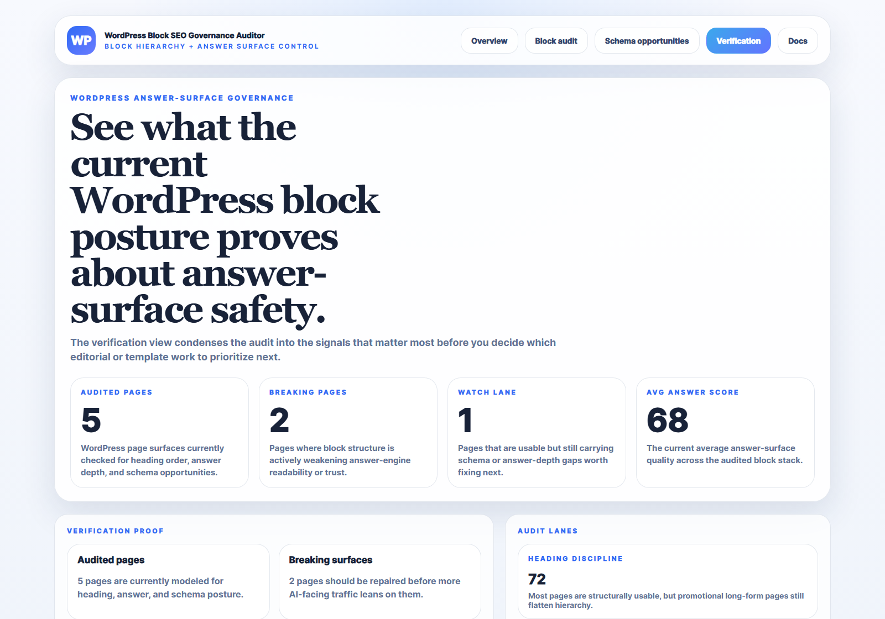

# WordPress Block SEO Governance Auditor

WordPress Block SEO Governance Auditor is a PHP control plane for auditing WordPress block hierarchy, answer-surface readiness, and schema opportunities across editorial pages.

It focuses on the real WordPress content problem:
- which pages have weak heading structure
- which FAQ and HowTo opportunities are still hidden inside generic blocks
- which promotional layouts are weakening answer-engine trust
- which content surfaces are structurally safe enough to repeat

## Routes

- `/` overview dashboard
- `/block-audit` page-by-page audit lane
- `/schema-opportunities` block-level schema and FAQ opportunities
- `/verification` proof posture
- `/docs` route and payload reference

## What this repo proves

- block-level SEO and AEO governance can be treated as an operator system, not just an editorial checklist
- WordPress block composition affects answer-surface quality as much as the copy itself
- schema opportunities are easier to capture when the page anatomy is already visible and scored
- PHP can still ship clean operator tooling in a modern portfolio context

## Screenshots






## Local development

```powershell
Set-Location "C:\Users\chaus\dev\repos\wordpress-block-seo-governance-auditor"
php -S 127.0.0.1:5172 router.php
```

## Validation

- `php -l public/index.php`
- `php -l src/Services/AuditService.php`
- `php scripts/run_demo.php`
- `powershell -ExecutionPolicy Bypass -File .\scripts\smoke_check.ps1`
- `powershell -ExecutionPolicy Bypass -File .\scripts\render_readme_assets.ps1`
